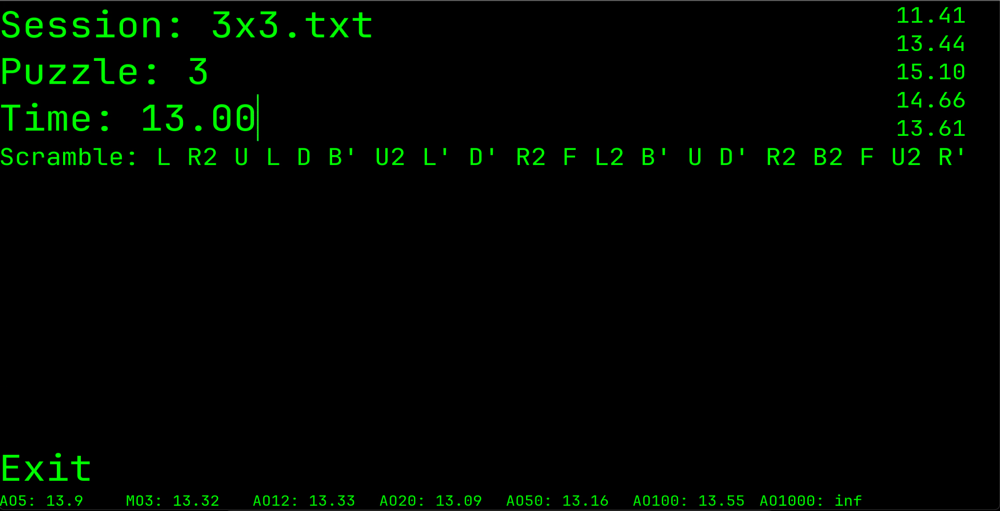

This program uses Python 3.11 and PyGame 2.5.1 (https://www.pygame.org/contribute.html)

# Purpose:
This program is designed to help cubers keep track of their times and averages for various WCA puzzles. It generates scrambles for the selected puzzle and allows users to input their times, which are then saved to text files corresponding to different sessions. The program also calculates and displays user-selected averages based on the recorded times.

# Before using the program:
Download the zip file under the Code menu. 
Create text files for each session you want to save times for.
It is recommended that the file names be short. 
Files should be formatted similar to the example file (example.txt) and use the .txt extension.
Any average type can be recorded for PB purposes, on line 3 of the .txt file.
Place these files in the same folder as the download.
Change the configuration settings to your liking.
Run the executable file corresponding to your operating system.

# Configuration Settings:
The averages or means displayed can be changed by listing up to 4 of them on the first line.
Note that averages start with "a" or "A" and means start with "m" or "M".
Font type and sizes can be changed on their respective lines.
The color of the background and text can be changed by typing in RGB values, only R,G,B is acceptable. 

# While running:
To use the program, type in the session name to save the results to, then the puzzle type for the scramble.
Press the Enter key on the keyboard to generate new scrambles.
Scrambles are only generated for WCA puzzles!
Type in a time and press Enter while the cursor is on the time input to save the time.
Times should be formatted like HH:MM:SS.XX, XXXX.XX, or MMSSXX.
Averages are automatically calculated at the bottom of the screen. 
Note that all times displayed and saved are formatted like XXXX.XX
To exit, click on the exit button.

# For contributors:
Bash scripts are provided to compile the program for all major operating systems.
